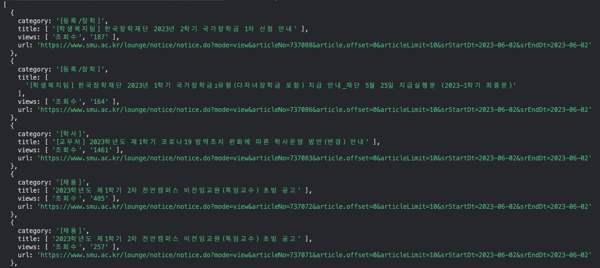

# 상명대학교 공지사항 크롤러 만들기  

## Chapter 3.
---
<br/>

## HTML은 어디서 가져와야 하나?
앞서 cheerio의 getting started를 따라가면서 cheerio는 html 문서를 조작하기 위한 것임을 알았다.  
그렇다면 크롤링할 html 문서는 어떻게 찾아야 할까?
<br/>
일단 대상 페이지를 들어가 개발자 도구를 열어 보자.  
헤더 탭을 보면 맨 처음 수행된 네트워크 요청에서 요청 url을 확인할 수 있다.  
이것이 우리가 html 문서를 가져올 때 요청할 경로다.  


<br/>

---
<br/>

## Axios
노드 환경에선 Axios라는 HTTP 요청을 처리하는 모듈을 제공하는 라이브러리가 있다.  
내가 만드는 프로그램은 따로 DB를 사용하진 않을 거라서 express로 서버를 구축하지 않고 요청과 그에 따른 로직만 수행할 것이므로 axios만 사용한다.  
axios 설치는 앞서 Chapter 2에서 진행했으므로 넘어가자.

<br/>
Chapter 2에서 작성한 cheerio에 대한 코드는 import를 제외하고 모두 지워주고, axios 모듈을 import하는 코드를 추가한다.  

<br/>

``` js
import * as cheerio from 'cheerio';
import axios from 'axios'
```

<br/>

위에서 구한 요청 URL을 저장하는 변수를 만들고 get 요청으로 html 문서를 받아온다. 이때 data가 어떻게 들어오는지 로그를 찍어 확인하자.  

<br/>

``` js
const getFormattedDate = () => {
    const today = new Date();
    const year = today.getFullYear();
    const month = today.getMonth() + 1; // getMonth는 0부터 시작하므로 1을 더해준다.
    const date = today.getDate();

    return `${year}-${month < 10 ? `0${month}` : `${month}`}-${date < 10 ? `0${date}` : `${date}`}`;
}

// 공지사항 페이지로 이동할 url을 생성하기 위해 base url과 query를 분리.
const SMUOfficialBaseURL = `https://www.smu.ac.kr/lounge/notice/notice.do`;
const SMUOfficialQuery = `?srcCampus=smu&srStartDt=${getFormattedDate()}&srEndDt=${getFormattedDate()}&mode=list&srCategoryId1=&srSearchKey=&srSearchVal=`;


axios.get(${SMUOfficialURL})
.then((res) => {
    console.log(res.data);
})
```


HTML 문서 위로 `<script>` 태그 안에 엄청난 가독성의 텍스트 데이터가 같이 오는 것을 볼 수 있다.  
해당 데이터가 css selector로 요소를 탐색할 때 방해가 되지 않을까 걱정했는데, CDATA 자체는 텍스트 데이터이기 때문에 HTML이나 XML 문서를 탐색하는 cheerio 함수엔 방해가 되지 않는다고 한다.  

<br/>

이제 진짜로 데이터를 뽑아 보자!  
cheerio로 요소를 선택하려면 CSS 선택자가 필요하다.  
여기서 꿀팁은, CSS 선택자는 눈알 빠지게 수동으로 구할 필요 없이 개발자 도구에서 바로 복사가 가능하다는 것이다.  

  

<br/>

``` js
axios.get(SMUOfficialURL)
.then((res) => {
    if(res.status === 200) {
        const $ = cheerio.load(res.data);   // 전체 html doc
        const $noticeList = $(listSelector).children('li');

        let todaysNoticeList = [];          // 오늘 올라온 공지를 저장하는 리스트
        
        $noticeList.each(function (idx, notice) {
            const category = $(notice).find(categorySelector).text();
            const title = $(notice).find(titleSelector).text();
            const views = $(notice).find(viewsSelector).text();
            const url = $(notice).find(titleSelector).attr('href');
            
            todaysNoticeList[idx] = {
                category: category,
                title: removeEscapeChar(title),
                views: removeEscapeChar(views),
                url: `${SMUOfficialBaseURL}${url}`
            }
        })
    }
})
.catch((err) => { console.log(err) })

// white space 제거하고 공백 요소 제거하기
const removeEscapeChar = (str) => {
    let arr = str.split('\n');

    let cleanedStr = arr.map((item) => {
        return item.trim();
    }).filter((item) => {
        return item !== '';
    })

    return cleanedStr;
}
```

내 데이터의 경우 필요한 내용 앞 뒤로 \n과 \t가 너무 많았기 때문에 이를 제거하는 함수 또한 추가했다.  
trim() 함수는 이걸 구현하면서 처음 알았는데, 문자열 양 끝의 공백을 제거하는 함수라고 한다.  
여기서 공백은 스페이스, 탭, 개행문자 등을 말한다.  

<br/>

짠. 드디어 데이터가 정상적으로 나온다! 다음 시간엔 이렇게 모은 데이터를 이메일로 보내는 것을 해보자.  

