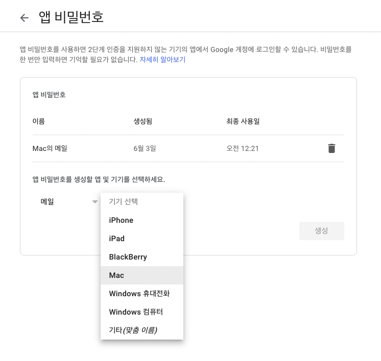
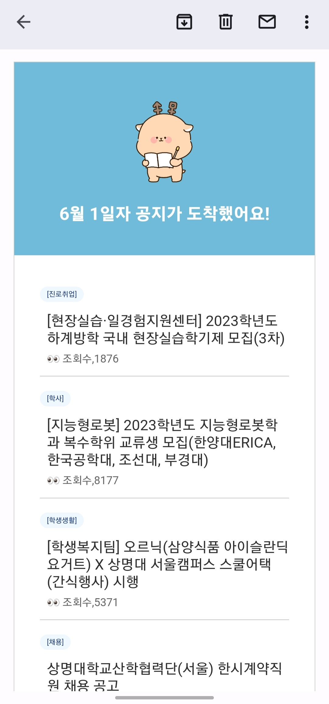

# 상명대학교 공지사항 크롤러 만들기  

## Chapter 4.
---
<br/>

## 이메일 전용 html 템플릿 제작
이번 프로젝트를 하며 알게된 사실인데, 이메일로 렌더링될 수 있는 html은 매우매우 한정적이다.  
apple, gmail, 네이버.. 이런 다양한 메일 플랫폼에 호환되기 위해서는 CSS 또한 인라인으로 작성해야 한다.(!!)  
인라인 안에서도 작성이 자유롭지 않다. 속성을 사용할 때 단축 속성이 아닌 개별 속성을 사용해야 한다.   
외에도 어떤 플랫폼을 사용하든 안정적으로 보여지기 위해서 지켜야 하는 규칙이 많다.  
[더 자세한 내용](https://velog.io/@zlevn/HTML-%EC%9D%B4%EB%A9%94%EC%9D%BC-%ED%85%9C%ED%94%8C%EB%A6%BF-%EA%B5%AC%EC%B6%95%ED%95%98%EA%B8%B0)은 잘 정리된 블로그 링크를 가져왔으니 클릭해 확인해보자..  


나는 레이아웃 잡는 것은 모두 table을 이용했고, 그 안에서 카테고리 타이틀과 같이 스타일링이 너무 어려운 것은 참지 못하고 div를 사용했다.  
<br/>

---
<br/>

## 또 다시 cheerio!
템플릿은 만들어졌지만, 스크래핑 해둔 데이터를 렌더링하기 위해선 html을 동적으로 생성해야 한다.  
cheerio를 복습하는 겸 다시 사용해보기로 했다.  

인자로 받은 `todaysNoticeList` 배열을 `map`으로 순회하면서 cheerio의 `.append()` API를 사용하여 가상돔에 리스트를 추가하는 것이 핵심이다.  

html 태그가 직접적으로 보여서 아쉽지만 API를 사용해서 일일이 속성을 편집한 코드가 가독성이 별로인 것 같아  
최종 코드는 이렇게 나왔다.  
``` js
import * as cheerio from 'cheerio';
import fs from 'fs';

export const makeHTML = async (todaysNoticeList, month, date) => {
    const html = fs.readFileSync('template.html', 'utf-8');
    const $ = cheerio.load(html);
    
    // change mail title
    $('#mail-title').text(`${month}월 ${date}일자 공지가 도착했어요!`);

    // change site name
    $('#smu').text(`상명대학교`);

    // make html with todaysNoticeList
    if(todaysNoticeList.length !== 0) {
        todaysNoticeList.map((noticeInfo) => {
            $('#contents > .notice > .notice-list').append(
            `<tr>
                <td>
                    <div>
                        <div class="category" style="display: inline-block; font-size: 8px; margin: 0; background-color: aliceblue; color: #183882; padding: 4px 8px; border-radius: 10px;">${noticeInfo.category}</div>
                    </div>
                    <a href="${noticeInfo.url}" style="font-size: 16px; color: #2f2f2f; text-decoration: none; display: block; margin-top: 12px; margin-left: 8px; margin-bottom: 6px;">${noticeInfo.title}</a>
                    <div style="font-size: 12px; margin: 0 8px; color: #656565;">👀 ${noticeInfo.views[1]}</div>
                    <div style="height: 1px; background-color: #d5d5d5; margin: 12px 0 16px 0;"></div>
                </td>
            </tr>`);
        })
        return $.html();
    }
    else {
        throw new Error('no data');
    }
}
```

<br/>

---
<br/>

## Nodemailer Setting
이메일 전송 라이브러리로 email.js와 nodemailer 둘 중에 고민을 했는데,  
email.js의 공식 문서가 좀 복잡하기도 했고, nodemailer의 자료가 훨씬 많았기 때문에 nodemailer를 선택했다.  

우선 nodemailer를 설치해준다.
```
npm i nodemailer
```

<br/>

## Gmail 2단계 인증 설정
나는 이메일 서비스로 gmail을 선택했다. 그런데 gmail의 경우 보안에 민감하기 때문에 따로 설정을 해줘야 한다.  
공식 사이트에 안내된 방법은 "Less Secure App" 설정과 "2FA"(2단계 인증) 두 가지인데,  
Less Secure App 설정은 현재 지원하지 않는 것 같아 2단계 인증을 했다.  
Google 계정 > 보안 > 2단계 인증 > 앱 비밀번호  
로 이동해 앱과 기기를 선택한 후 생성하면 비밀번호가 뜬다. 이 비밀번호를 .env 파일에 저장해두고 transporter의 config로 넣어줄 것이다.  



<br/>

## 환경 변수(.env) 파일 설정
보통 토큰이나 키 같은 공개적인 곳에 올라가면 안되는 민감한 정보는 .env 파일에 넣어서 관리한다.  
env 파일에서 값을 편리하게 가져오기 위한 dotenv 라이브러리를 설치한다.
```
npm i dotenv
```

나는 .env에 이메일 서비스, 메일 주소, 비밀번호를 넣어 관리하도록 했다.  
해당 정보를 가져오는 코드는 아래와 같다.
``` js
import dotenv from 'dotenv';
dotenv.config();

const { EMAIL_SERVICE, EMAIL_ADDRESS, EMAIL_PASSWORD } = process.env;
```
드디어 세팅이 완료됐다!

<br/>

---

<br/>

## 메일을 보내자!

nodemailer에는 transporter와 transport라는 개념이 있다.  
transporter는 메일을 보내는 오브젝트이고, transport는 설정 오브젝트(configuration object)이다.  
발신자 정보와 이용할 이메일 서비스에 대한 설정을 담은 transport 객체를 `nodemailer.createTransport()`에 인자로 전달하여 transporter를 생성한다.  
이렇게 생성된 transporter의 `transporter.sendMail()` 함수를 통해서 메일을 보낼 수 있다.  
``` js
// data: mailOptions
// callback: (err, info) => {}
transporter.sendMail(data[, callback])
```

나는 이 함수를 동명의 async 콜백함수로 감쌌는데, 그 이유로는 두 가지가 있다.  
먼저 데이터를 담을 mailOptions 객체에 html을 전달할 건데, 이 함수를 모듈화하여 사용할 것이므로 html을 인자로 받을 수 있는 구조가 필요했다.  
또한 transporter는 기본적으로 **Promise를 반환하지 않으므로** err와 info(성공 시)를 catch와 then으로 핸들링하기 위해서는 반환 시 Promise 객체로 감싸주는 async 키워드를 붙이는 것이 좋겠다고 생각했다.  

그래서! 최종 코드는 아래와 같다.  
``` js
import nodemailer from 'nodemailer';
import dotenv from 'dotenv';
dotenv.config();

const { EMAIL_SERVICE, EMAIL_ADDRESS, EMAIL_PASSWORD } = process.env;

const transporter = nodemailer.createTransport({
    service: EMAIL_SERVICE,
    auth: {
        user: EMAIL_ADDRESS,    // 발신자 메일 주소
        pass: EMAIL_PASSWORD    // 발신자 메일 비밀번호
    }
});

export const sendMail = async (html, date) => {
    const mailOptions = {
        from : EMAIL_ADDRESS,
        to: EMAIL_ADDRESS,
        subject: `[${date}] 상명대학교 공지사항 알림`,
        html: html
    };

    transporter.sendMail(mailOptions, (error, info) => {
        if (error) {
            return error
        } else {
            console.log('Email Sent : ', info);
            return info;
        }
    })
}
```

index.js에서 Chapter 3에서 만든 makeHTML과 이번 시간에 만든 sendMail 모듈을 로직에 추가한다.  
``` js
axios.get(`${SMUOfficialBaseURL}${SMUOfficialQuery}`)
.then((res) => {
    if(res.status === 200) {
        const $ = cheerio.load(res.data);   // full html doc
        const $noticeList = $(listSelector).children('li');
        
        let todaysNoticeList = [];

        $noticeList.each(function (idx, notice) {
            const category = $(notice).find(categorySelector).text();
            const title = $(notice).find(titleSelector).text();
            const views = $(notice).find(viewsSelector).text();
            const url = $(notice).find(titleSelector).attr('href');
            
            todaysNoticeList[idx] = {
                category: category,
                title: removeEscapeChar(title),
                views: removeEscapeChar(views),
                url: `${SMUOfficialBaseURL}${url}`
            }
        })
        return todaysNoticeList;
    }
})
// 추가된 부분
.then((todaysNoticeList) => {
    makeHTML(todaysNoticeList, month, date)
    .then((html) => {
        sendMail(html, formattedDate);
    })
    .catch((err) => {
        return err;
    })
})
.catch((err) => { console.log(err) })
```

<br/>

결과는 이렇게..!
<br/>

  

<br/>

---

<br/>

## 다음엔..
다음 챕터에서는 Github Actions에서 cron 설정을 통해 이 프로그램을 원하는 시간에 자동으로 돌릴 수 있도록 세팅할 것이다.  
드디어 Github Actions를 공부할 수 있게 되어서 기대된다!