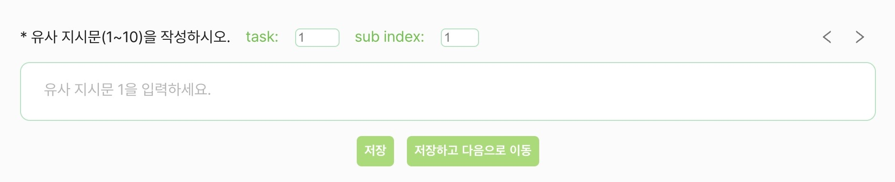
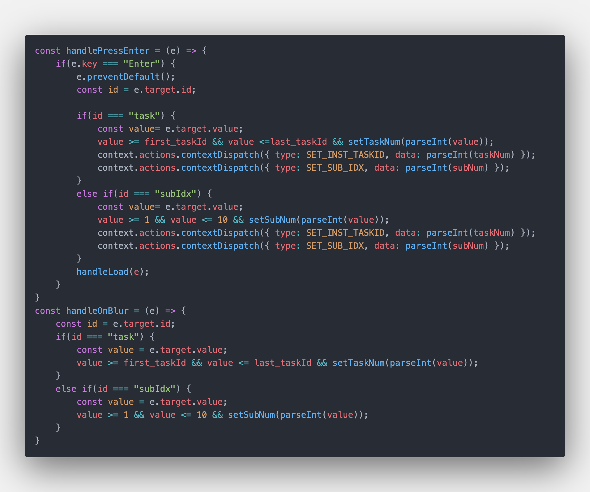
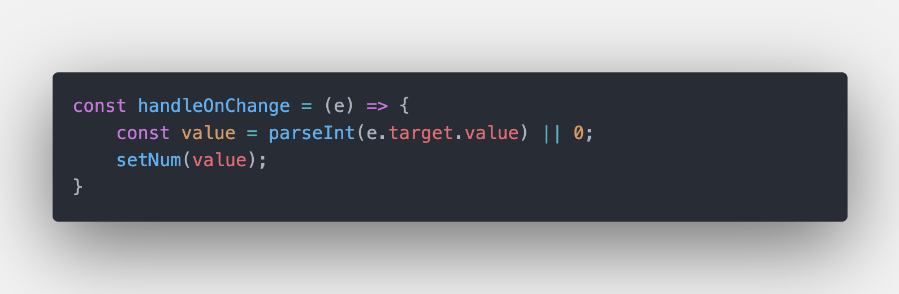
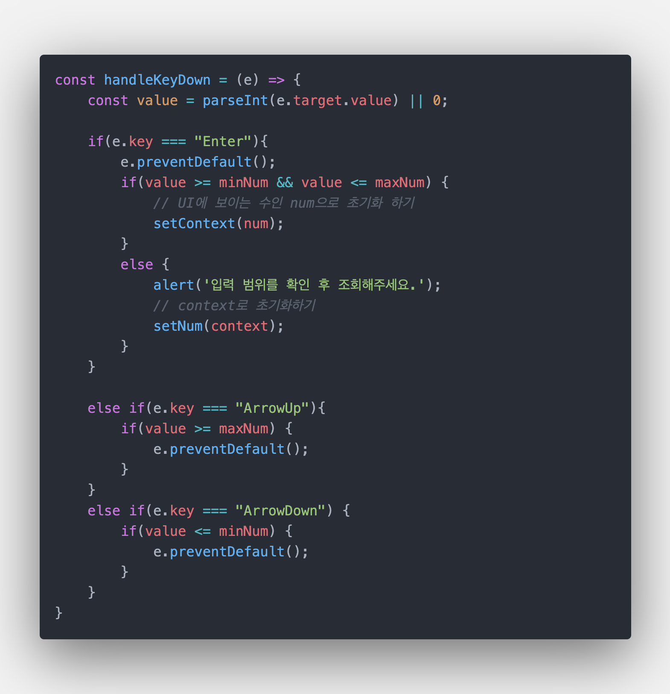
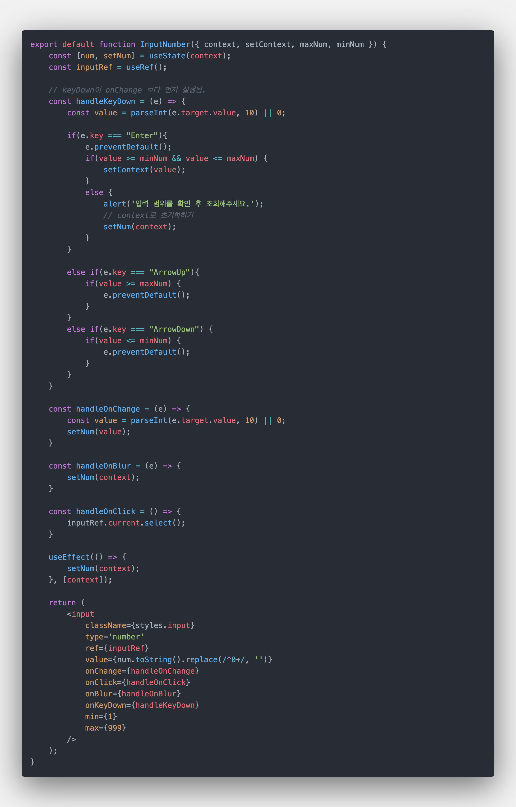

# 2023-04-23 TIL : Number 타입 Input 커스텀 컴포넌트 제작기

조금 삐그덕 거렸지만 ChatPrompt가 성공적으로 배포되고 서비스 된지 1주일이 지난 시점이었다. <br> 프로토타입 빌드 수준으로 급하게 만든 거라 떨리는 마음으로 사용자들의 후기를 기다렸는데 역시나 불편을 호소하는 부분이 많았다. <br> 특히 가장 의견이 많았던 부분이 사용자에게 할당된 태스크를 조회하기 위한 `<input>`의 사용성에 대한 것이었다. <br> 
<br> 다른 마감 때문에 임시 방편으로 태스크를 이동할 수 있는 다양한 버튼을 추가해 줬지만, <br> 앞으로 3주나 더 이 웹 페이지를 사용 할 구축자들을 위해 근본적인 문제를 해결하지 않고 넘어갈 수는 없다는 생각이 들어 사용성 개선과 리팩토링을 결심했다.


***

<br>

### 기존 방식의 문제점
number 타입의 input(이하 number)엔 입력 가능한 최대값과 최소값을 min과 max를 통해서 지정해줄 수 있다. <br> 그런데 이때의 min과 max는 방향키로 number를 조절할 때 범위를 지정해 주지, 사용자가 넘패드로 직접 입력한 값에 대해서 검사해주지는 않는다. <br> 만약 사용자가 할당된 태스크가 아닌 숫자를 입력한 뒤 엔터를 누르면 다른 사용자의 태스크에 영향을 줄 수도 있는 것이다. <br> 그래서 onChange 이벤트가 일어날 때 value를 검사해서 범위를 지정해줬다.
``` jsx
const [num, setNum] = useState(1);
const minNum = 31;
const maxNum = 60;

<input 
    type='number' 
    value={num} 
    onChange={(e) => {
        const value = parseInt(e.target.value);
        value <= maxNum && value >= minNum && setNum(value);
    }}
    min={1} 
    max={999} // input 창의 너비를 지정해주기 위해 3자리수인 999를 넣어준다.
/>
```
문제는 이렇게 최대값과 최소값이 지정되면, 값을 입력하는 데 있어서 엄청 불편해진다는 것이다.<br> 예를 들어 `31`이 input 안에 들어가 있는 상황에서 1의 자리 수만 8로 바꾸려는 상황이라고 해보자. 사용자는 자연스럽게 `1`을 지우고... 지우... 어? 안 지워진다. <br><br>
당연하다. '31'에서 '1'을 지우면 `e.target.value`는 '3'이 되므로 지정한 범위에 맞지 않기 때문에 `num`이 초기화되지 않고, 때문에 값이 변하지 않기 때문이다. <br><br>
이런 문제 때문에 사용자들이 불편을 호소했고, 이를 고쳐보려고 한다.
<br><br>

***

### 커스텀 컴포넌트 만들기
왜 굳이 커스텀 컴포넌트를 만드는가..! number에 대한 로직을 고치려고 코드를 살펴 보니 코드 중복이 엄청났기 때문이다. <br> 엔터를 누를 때 처리할 `handleKeyDown`, number를 controlled component로 사용하기 위한 `handleOnChange`, `handleOnblur`, `handleOnClick`.. <br> 이런 이벤트 처리 함수들과, 만약 input이 2개라면 따로 처리하는 코드, 데이터를 로드하는 코드까지 한 데 뒤엉켜 유지 보수하기 힘든 코드였다. <br><br>

<br><br>

### 공통 요소를 뽑아보자!
number들의 공통 요소를 뽑으니 아래와 같이 됐다. <br>
1. 내부적으로 number의 값을 관리해주는 state
2. number와 연관된 context들
3. 범위 지정을 위한 min, max 값
4. DOM 이벤트 핸들러

위의 요소 중에서 2번과 3번은 컴포넌트 밖에서 받아와야 하는 것이고, 1번과 4번은 컴포넌트 바깥에서는 알 필요가 없으므로 캡슐화하는 것이 좋을 것 같다고 판단했다.<br>
<span style="color: gray">여담으로 context가 필요한 이유는 user에 대한 정보를 api를 통해 받아올 때 가장 최근에 수정한 task id를 받아 오는데, 이를 여러 컴포넌트에서 사용하기 때문이다.</span>
<br><br>
최종적으로 이런 구조가 만들어졌다.
```jsx
export default function InputNumber({ context, setContext, maxNum, minNum }){
    const [num, setNum] = useState(context);
    const inputRef = useRef();

    const handleKeyDown = (e) => {} // event handler;
    const handleOnChange = (e) => {} // event handler;
    const handleOnBlur = (e) => {} // event handler;
    const handleOnClick = (e) => {} // event handler;

    return (
        <input
            className={styles.input}
            type='number'
            ref={inputRef}
            value={num.toString().replace(/^0+/, '')}
            onChange={handleOnChange}
            onClick={handleOnClick}
            onBlur={handleOnBlur}
            onKeyDown={handleKeyDown}
            min={1}
            max={999}
        />
    );
}
```

<br>

***

### 컴포넌트를 만들자! - 요구사항
구조가 다 만들어 졌으니 기능을 만들어야 할 차례다. 기능을 요약 해보면 아래와 같았다. <br> 
1. 숫자패드로 숫자를 입력할 때는 자연스럽게 입력이 가능해야 한다.
2. 엔터를 쳐서 input 안의 값을 확정지을 때 그 값이 범위를 벗어나면 바꾸기 이전의 값으로 초기화되어야 한다.
3. focus를 잃을 때도 2의 내용이 적용되어야 한다.

<br>

### handleOnChange
onChange 핸들러는 매우 간단해졌다. <br>
number에 공백이 들어갈 경우 `parseInt`의 값이 NaN가 나오므로 이에 대응해서 처리만 해주면 끝이다.<br><br>

<br><br>

### handleOnKeyDown
key가 눌리는 동작은 크게 3가지로 나누어졌다.
- 조회할 숫자를 확정짓기 위해 누르는 엔터
- 숫자를 조작하기 위해 누르는 위, 아래 방향키
- 그냥 커서를 조작하기 위해 누르는 기타 키들

위의 경우에서 엔터와 방향키에 대한 이벤트만 관리하면 된다. <br>
1. **엔터를 누르는 경우**<br>
   number에 입력된 값(`e.target.value`)를 보고 범위가 맞지 않으면 alert 출력 후 현재 로드된 데이터에 대한 id인 context로 초기화 한다.
2. **위, 아래 방향키를 누르는 경우**<br>
   number에서 위 아래 방향키의 디폴트 액션은 숫자를 1씩 증가/감소시키는 것이다. 원래라면 input의 속성으로 지정된 min과 max 사이의 값으로 자동으로 맞춰지겠지만, 현재 우리의 input은 딱히 이를 강제하고 있지 않으므로 따로 처리를 해줘야 한다. <br>
   방법은 간단하다. 조건문을 붙여서 기본 액션을 취소하는 `e.preventDefault()`를 넣어주면 된다.

최종적으로 아래와 같은 코드가 완성됐다.<br><br>

<br><br>

### handleOnBlur
포커스를 잃을 때 발생하는 코드이므로, 엔터로 제출했을 때와 마찬가지로 그냥 context로 초기화되도록 했다. <br>
``` jsx
const handleOnBlur = (e) => {
   setNum(context);
}
```
<br><br>

### 전체 코드!
<br>

`<InputNumber/>`


<br><br>

InputNumber를 사용하는 컴포넌트의 코드
``` jsx
const taskId = context.state.data.inst_taskId;
const handleTaskId = (value) => {
   context.actions.contextDispatch({ 
        type: SET_INST_TASKID, 
        data: parseInt(value)
   })
}

return (
    <InputNumber
        context={taskId}
        setContext={handleTaskId} 
        maxNum={last_taskId} 
        minNum={first_taskId}
    />
);
```
[이전 코드](###커스텀-컴포넌트-만들기)에 비해 깔끔한 코드 작성이 가능한 걸 볼 수 있다!

### 동작
<br>

 <br><br>

### 여담
꽤나 까다로운 로직이 필요할 줄 알고 항상 스케줄에서 우선순위가 밀렸는데 (실제로 초안은 꽤 복잡했다.) <br> 막상 구현하면서 이벤트의 실행 순서나 작동 원리에 대해서 알아가니 생각보다 쉽게 구현 가능했다.. <br> 좀 더 빨리 시도했다면 사용자들이 편하게 썼을텐데 하는 아쉬움이 들기도. 🥺 <br><br>
컴포넌트에서 input 관련한 로직을 싹 빼니 코드의 흐름이 눈에 더 잘 들어와서 기존에 있던 로직의 문제점도 발견했다. <br> 컴포넌트에 너무 많은 책임이 치중되지 않도록 작게 분리하라는 말을 절실하게 깨닫는 경험이었다. <br> 시간이 된다면 앞 뒤로 이동하는 button 도 비슷하게 추상화 해야겠다.
